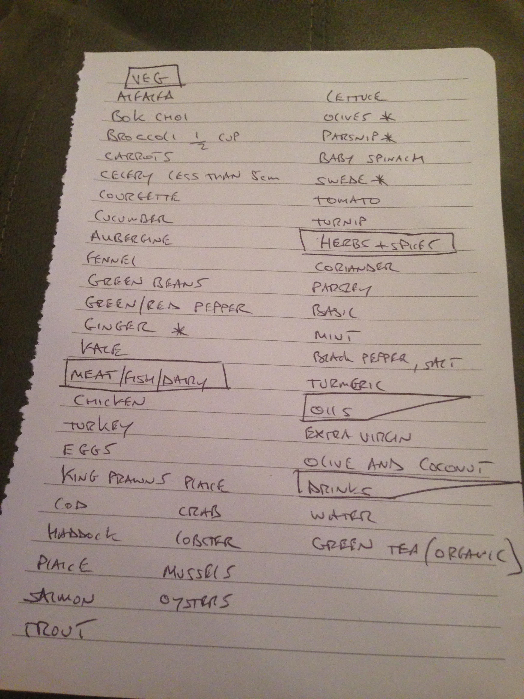

## Diet

Here is the list of what can be eaten in Adam' Football diet:

#### Food list

- **Veg**

  - Alfalfa
  - Bok Choi
  - Broccoli (1/2 cup)
  - Carrots
  - Celery (less than 5cm)
  - Courgette
  - Cucumber
  - Aubergine
  - Fennel
  - Green Beans
  - Green/Red Pepper
  - Ginger *
  - Kale
  - Lettuce
  - Olives
  - Parsnip
  - Baby Spinach
  - Swede
  - Tomato
  - Turnip

- **Meat/Fish/Dairy**

  - Chicken
  - Turkey
  - Eggs
  - King Prawns
  - Haddock
  - Plaice
  - Salmon
  - Trout
  - Crab
  - Lobster
  - Mullels
  - Oysters

- **Herbs + Spices**

  - Coriender
  - Parsley
  - Basil
  - Mint
  - Black Pepper
  - Salt
  - [Turmeric](https://en.wikipedia.org/wiki/Turmeric)

- **oils**

  - Extra Virgin
  - Olive and Coconut

- **Drinks**
  - Water
  - Green Tea
  - Lemon juice

#### Original screnshot

